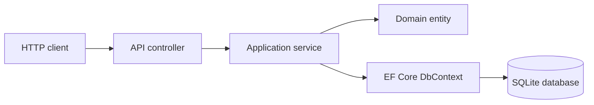

# Architecture

TaskBoard Lite API uses a restrained three-project structure:

```text
TaskBoardLite.Api -> TaskBoardLite.Infrastructure -> TaskBoardLite.Domain
TaskBoardLite.Api -> TaskBoardLite.Domain
```

The dependency direction points inward. The domain project does not depend on ASP.NET Core or EF Core.



## Project Responsibilities

`TaskBoardLite.Domain` contains entities, enums, domain exceptions, validation that belongs to entities, and work-item status transition logic.

`TaskBoardLite.Infrastructure` contains `TaskBoardLiteDbContext`, entity configurations, migrations, SQLite configuration, and development database initialization.

`TaskBoardLite.Api` contains startup, controllers, DTOs, mapping methods, services, validation attributes, exception handling, and HTTP status behavior.

## Request Flow

A typical create-work-item request travels like this:

1. ASP.NET Core binds JSON to a request DTO.
2. Data annotation validation runs at the API boundary.
3. The controller calls `WorkItemService`.
4. The service checks that the project exists.
5. The service creates a `WorkItem` domain entity.
6. The domain constructor enforces title, project id, default status, and initial version rules.
7. EF Core saves the entity through `TaskBoardLiteDbContext`.
8. The service maps the saved entity to a response DTO.
9. The controller returns `201 Created` with a `Location` header.

## Validation

API validation handles missing fields, string lengths, invalid enum JSON, and invalid pagination/sorting query parameters.

Domain validation handles entity state and status transitions. A status change must go through `WorkItem.ChangeStatus`.

Database validation handles unique project codes, foreign keys, required columns, maximum lengths, and indexes.

## Optimistic Concurrency

`WorkItem.Version` starts at `1`. Clients must send the version they read when updating a work item or changing status.

The service compares the requested version to the stored version. If they differ, the API returns `409 Conflict`. On a successful mutation, the domain entity increments the version. EF Core also treats `Version` as a concurrency token so a conflicting save can be detected.

This prevents a stale client from overwriting changes made by another request after the stale client loaded the work item.

## SQLite Choice

SQLite was selected because the project should run locally without Docker or external infrastructure. EF Core migrations are included, and the application applies migrations automatically only in `Development`.

SQLite does not support sorting `DateTimeOffset` directly through EF Core, so timestamp values are stored as UTC ticks using Fluent API conversions.

## Why Certain Patterns Were Not Used

A generic repository was not used because EF Core already provides query composition, change tracking, transactions, and async persistence.

CQRS was not used because the application has a small set of straightforward commands and queries.

Microservices were not used because this is one learning-focused API with one database and no separate deployment needs.

## Current Limitations

The project does not include authentication, authorization, user accounts, production secret storage, monitoring, rate limiting, deployment infrastructure, or a hosted database.
